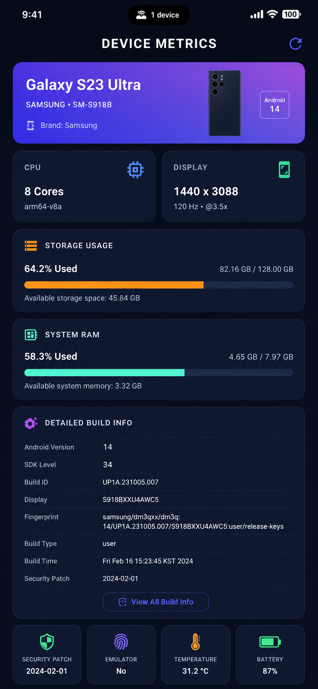
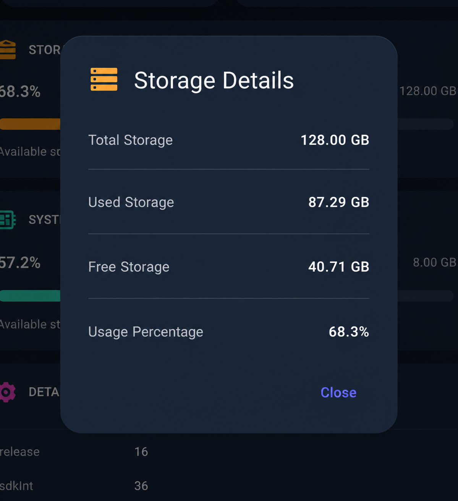
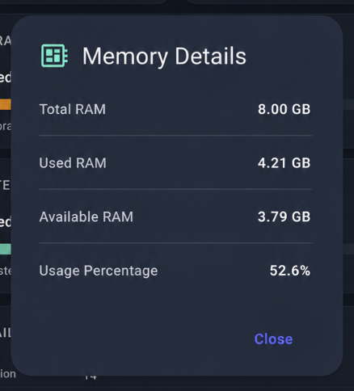

# advanced_device_info

[](https://pub.dev/packages/advanced_device_info)
[](https://flutter.dev)
[](https://pub.dev/packages/advanced_device_info)
[](LICENSE)
[](https://pub.dev/packages/advanced_device_info/score)

A production-ready Flutter plugin for retrieving comprehensive system-level device and hardware information on Android and iOS using native platform APIs.

---

# ✨ Features

## 📱 Device Information

- Device Name
- Manufacturer
- Brand
- Model
- Product
- Hardware
- Board
- Fingerprint
- Build ID
- Build Type
- Build Tags
- Build Host
- SDK Version
- Android Version
- Emulator Detection

---

## 💾 Storage Information

- Total Storage
- Used Storage
- Free Storage
- Storage Usage Percentage

---

## 🧠 Memory Information

- Total RAM
- Used RAM
- Available RAM
- Memory Usage Percentage

---

## ⚡ CPU Information

- CPU Architecture
- CPU ABI
- Number of CPU Cores

---

## 🖥 Screen Information

- Width
- Height
- Pixel Density
- Refresh Rate

---

# 📦 Installation

Add this package to your **pubspec.yaml**

```yaml
dependencies:
  advanced_device_info: ^0.0.1
```

Install packages

```bash
flutter pub get
```

---

# ✅ Platform Support

| Platform | Support |
|----------|---------|
| Android | ✅ |
| iOS | ✅ |
| Windows | 🚧 Planned |
| macOS | 🚧 Planned |
| Linux | 🚧 Planned |
| Web | ❌ |

---

# 🚀 Quick Start

Import the package

```dart
import 'package:advanced_device_info/advanced_device_info.dart';
```

Get all system information

```dart
final SystemInfo info =
    await AdvancedDeviceInfo.getSystemInfo();
```

---

# 📖 Usage

## Complete Device Information

```dart
try {

  final SystemInfo systemInfo =
      await AdvancedDeviceInfo.getSystemInfo();

  print(systemInfo.deviceInfo.deviceName);

  print(systemInfo.memoryInfo.totalRam);

  print(systemInfo.storageInfo.totalStorage);

  print(systemInfo.cpuInfo.cores);

  print(systemInfo.screenInfo.width);

} catch (e) {

  print(e);

}
```

---

## Individual APIs

### Device Information

```dart
final DeviceInfo info =
    await AdvancedDeviceInfo.getDeviceInfo();
```

### Storage

```dart
final StorageInfo storage =
    await AdvancedDeviceInfo.getStorageInfo();
```

### Memory

```dart
final MemoryInfo memory =
    await AdvancedDeviceInfo.getMemoryInfo();
```

### CPU

```dart
final CpuInfo cpu =
    await AdvancedDeviceInfo.getCpuInfo();
```

### Screen

```dart
final ScreenInfo screen =
    await AdvancedDeviceInfo.getScreenInfo();
```

---

# 📚 API Reference

| Method | Description |
|---------|-------------|
| getSystemInfo() | Returns all device information |
| getDeviceInfo() | Returns device metadata |
| getStorageInfo() | Returns storage information |
| getMemoryInfo() | Returns RAM information |
| getCpuInfo() | Returns CPU information |
| getScreenInfo() | Returns display information |

---

# 📄 Example Output

```text
Device Name : Pixel 9 Pro

Manufacturer : Google

Model : Pixel 9 Pro

Brand : google

Android Version : 16

SDK : 36

CPU : arm64-v8a

CPU Cores : 8

RAM : 12 GB

Storage : 256 GB

Storage Used : 118 GB

Screen : 1344 x 2992

Refresh Rate : 120 Hz

Is Emulator : false
```

---

# 📸 Screenshots

### Dashboard

<p align="center">

</p>

### Storage Information

<p align="center">

</p>

### Memory Information

<p align="center">

</p>

> Create a `screenshots/` folder in the repository and place the images there.

---

# 🔐 Permissions

## Android

No dangerous permissions are required.

The plugin only accesses publicly available system information.

## iOS

No additional permissions are required.

---

# ⚠ Platform Limitations

Some information depends on operating system restrictions.

| Feature | Android | iOS |
|----------|---------|-----|
| Device Name | ✅ | ✅ |
| Storage | ✅ | ✅ |
| RAM | ✅ | ✅ |
| CPU | ✅ | Limited |
| Build Info | ✅ | Limited |
| Emulator Detection | ✅ | ✅ |

---

# 🛣 Roadmap

## v0.1

- ✅ Device Information
- ✅ Storage Information
- ✅ Memory Information
- ✅ CPU Information
- ✅ Screen Information

---

## v0.2

- Battery Information
- Network Information
- Locale Information
- Application Information

---

## v0.3

- Sensors
- Root Detection
- Developer Options Detection
- USB Debugging Detection
- Thermal Information

---

## v1.0

- Stable Release
- Performance Optimizations
- Full Documentation
- Complete Test Coverage

---

# 🤝 Contributing

Contributions are welcome.

If you'd like to improve this package:

1. Fork the repository
2. Create a new branch
3. Commit your changes
4. Submit a Pull Request

Please read `CONTRIBUTING.md` before contributing.

---

# 📄 License

This project is licensed under the MIT License.

See the [LICENSE](LICENSE) file for details.